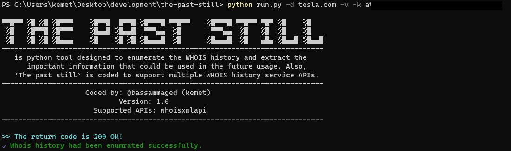

<p align="center"> 
  
</p>
<h1 align="center">The Past Still</h1>
<p align="center">Your past runs after you</p>
<p align="center"> The past still is python tool designed to enumerate the WHOIS history and extract the important information that could be used in the future usage. Also, `The past still` is coded to support multiple WHOIS history service APIs.</p>  

<!-- TABLE OF CONTENTS -->
<h2 id="table-of-contents"> :book: Table of Contents</h2>

<details open="open">
  <summary>Table of Contents</summary>
  <ol>
    <li><a href="#screen">Screenshot</a></li>
    <li><a href="#about-the-tool">Additional Info</a></li>
    <li><a href="#technologies">Technologies in use</a></li>
    <li><a href="#prerequisites">Prerequisites</a></li>
    <li><a href="#modules">Modules</a></li>
    <li><a href="#how-to-install">How to Install</a></li>
    <li><a href="#results-and-discussion">Results and FQAs</a></li>
    <li><a href="#experiments">Experiments</a></li>
    <li><a href="#references">References</a></li>
    <li><a href="#contributors">Contributors</a></li>
  </ol>
</details>


<h2 id="screen"> :clapper: Screenshot</h2>
<p align="center"> 
  
</p>

```sh
▀▀█▀▀ ▒█░▒█ ▒█▀▀▀ 　 ▒█▀▀█ ░█▀▀█ ▒█▀▀▀█ ▀▀█▀▀ 　 ▒█▀▀▀█ ▀▀█▀▀ ▀█▀ ▒█░░░ ▒█░░░
░▒█░░ ▒█▀▀█ ▒█▀▀▀ 　 ▒█▄▄█ ▒█▄▄█ ░▀▀▀▄▄ ░▒█░░ 　 ░▀▀▀▄▄ ░▒█░░ ▒█░ ▒█░░░ ▒█░░░
░▒█░░ ▒█░▒█ ▒█▄▄▄ 　 ▒█░░░ ▒█░▒█ ▒█▄▄▄█ ░▒█░░ 　 ▒█▄▄▄█ ░▒█░░ ▄█▄ ▒█▄▄█ ▒█▄▄█
-----------------------------------------------------------------------------
   is python tool designed to enumerate the WHOIS history and extract the
      important information that could be used in the future usage. Also,
   `The past still` is coded to support multiple WHOIS history service APIs.
-----------------------------------------------------------------------------
                    Coded by: @bassammaged (kemet)
                            Version: 1.0
                      Supported APIs: whoisxmlapi
-----------------------------------------------------------------------------
> logs directory contains all *.log files that are generated by the script.
> results are saved in a file named with `target's domain`-result.ext at the-past-still directory.

usage: run.py [-h] -d compnay.com -k at_gixxx [-e Service name] [-v]

Required:
  -d compnay.com   Domain name to enumrate the whois history
  -k at_gixxx      API key for the service, if the service is not supporting API, enter `None`

options:
  -h, --help       show this help message and exit
  -e Service name  Enable one of supported APIs. Default value is `whoisxmlapi`
  -v               Enable the verbose mode and display results in realtime, by default is False
```

<h2 id="about-the-tool"> :pencil: Additional Info</h2>

  Which kind of information is extracted by `The past still`:
  
  - Administrative name, email and telephone.
  - Technical name, email and telephone.
  - Contacts information (name, email and telephone).
  
  Output formats:
  - JSON format.
  
<h2 id="technologies"> :fuelpump: Technologies in use</h2>

<!-- https://github.com/Ileriayo/markdown-badges -->


<h2 id="modules"> :blue_book: Modules</h2>
<p>`The past still` supports multiple whois history service via valid API</p> 

> Note: `The past still` supports one APIs currently.

the list of supported APIs
1. whoisxmlapi 

<h2 id="prerequisites"> :cd: Prerequisites</h2>

1. Python3
2. pip package manager

<h2 id="how-to-install"> :cd: How to Install</h2>

1. `The past still` is written with python v3.10
2. Install the required package via `pip3 install -r requirements.txt`.

<h2 id="results-and-discussion"> :paperclip: Results and FQAs</h2>

```json
{"1": {"registrantName": "Domain Administrator", "registrantEmail": "admin@dnstinations.com", "registrantTelephone": "14155319335", "administrativeName": "Domain Administrator", "administrativeEmail": "admin@dnstinations.com", "administrativeTelephone": null, "technicalNamel": "Domain Administrator", "technicalEmail": "admin@dnstinations.com", "technicalTelephone": null}, "2": {"registrantName": "Domain Administrator", "registrantEmail": "admin@dnstinations.com", "registrantTelephone": "14155319335", "administrativeName": "Domain Administrator", "administrativeEmail": "admin@dnstinations.com", "administrativeTelephone": "14155319335", "technicalNamel": "Domain Administrator", "technicalEmail": "admin@dnstinations.com", "technicalTelephone": "14155319335"}, "3": {"registrantName": "Domain Administrator", "registrantEmail": "admin@dnstinations.com", "registrantTelephone": "14155319335", "administrativeName": "Domain Administrator", "administrativeEmail": "admin@dnstinations.com", "administrativeTelephone": "14155319335", "technicalNamel": "Domain Administrator", "technicalEmail": "admin@dnstinations.com", "technicalTelephone": "14155319335"}, "4": {"registrantName": "Domain Administrator", "registrantEmail": "admin@dnstinations.com", "registrantTelephone": "14155319335", "administrativeName": "Domain Administrator", "administrativeEmail": "admin@dnstinations.com", "administrativeTelephone": "14155319335", "technicalNamel": "Domain Administrator", "technicalEmail": "admin@dnstinations.com", "technicalTelephone": "14155319335"}, "5": {"registrantName": "Domain Administrator", "registrantEmail": "admin@dnstinations.com", "registrantTelephone": "14155319335", "administrativeName": "Domain Administrator", "administrativeEmail": "admin@dnstinations.com", "administrativeTelephone": "14155319335", "technicalNamel": "Domain Administrator", "technicalEmail": "admin@dnstinations.com", "technicalTelephone": "14155319335"}, "6": {"registrantName": "Domain Administrator", "registrantEmail": "admin@dnstinations.com", "registrantTelephone": "14155319335", "administrativeName": "Domain Administrator", "administrativeEmail": "admin@dnstinations.com", "administrativeTelephone": null, "technicalNamel": "Domain Administrator", "technicalEmail": "admin@dnstinations.com", "technicalTelephone": null}, "7": {"registrantName": "Domain Administrator", "registrantEmail": "admin@dnstinations.com", "registrantTelephone": "14155319335", "administrativeName": "Domain Administrator", "administrativeEmail": "admin@dnstinations.com", "administrativeTelephone": null, "technicalNamel": "Domain Administrator", "technicalEmail": "admin@dnstinations.com", "technicalTelephone": null}, "8": {"registrantName": "Domain Administrator", "registrantEmail": "admin@dnstinations.com", "registrantTelephone": "14155319335", "administrativeName": "Domain Administrator", "administrativeEmail": "admin@dnstinations.com", "administrativeTelephone": "14155319335", "technicalNamel": "Domain Administrator", "technicalEmail": "admin@dnstinations.com", "technicalTelephone": "14155319335"}, "9": {"registrantName": null, "registrantEmail": null, "registrantTelephone": null, "administrativeName": null, "administrativeEmail": null, "administrativeTelephone": null, "technicalNamel": null, "technicalEmail": null, "technicalTelephone": null}, "10": {"registrantName": "Domain Administrator", "registrantEmail": "admin@dnstinations.com", "registrantTelephone": "14155319335", "administrativeName": "Domain Administrator", "administrativeEmail": "admin@dnstinations.com", "administrativeTelephone": "14155319335", "technicalNamel": "Domain Administrator", "technicalEmail": "admin@dnstinations.com", "technicalTelephone": "14155319335"}, "11": {"registrantName": "Domain Administrator", "registrantEmail": "admin@dnstinations.com", "registrantTelephone": "14155319335", "administrativeName": "Domain Administrator", "administrativeEmail": "admin@dnstinations.com", "administrativeTelephone": "14155319335", "technicalNamel": "Domain Administrator", "technicalEmail": "admin@dnstinations.com", "technicalTelephone": "14155319335"}, "12": {"registrantName": "Domain Administrator", "registrantEmail": "admin@dnstinations.com", "registrantTelephone": "14155319335", "administrativeName": "Domain Administrator", "administrativeEmail": "admin@dnstinations.com", "administrativeTelephone": "14155319335", "technicalNamel": "Domain Administrator", "technicalEmail": "admin@dnstinations.com", "technicalTelephone": "14155319335"}, "13": {"registrantName": "Domain Administrator", "registrantEmail": "admin@dnstinations.com", "registrantTelephone": "14155319335", "administrativeName": "Domain Administrator", "administrativeEmail": "admin@dnstinations.com", "administrativeTelephone": "14155319335", "technicalNamel": "Domain Administrator", "technicalEmail": "admin@dnstinations.com", "technicalTelephone": "14155319335"}, "14": {"registrantName": "Matt Serlin", "registrantEmail": "admin@dnstinations.com", "registrantTelephone": "14155319335", "administrativeName": "Matt Serlin", "administrativeEmail": "admin@dnstinations.com", "administrativeTelephone": "14155319335", "technicalNamel": "Matt Serlin", "technicalEmail": "admin@dnstinations.com", "technicalTelephone": "14155319335"}, "15": {"registrantName": "Matt Serlin", "registrantEmail": "admin@dnstinations.com", "registrantTelephone": "14155319335", "administrativeName": "Matt Serlin", "administrativeEmail": "admin@dnstinations.com", "administrativeTelephone": "14155319335", "technicalNamel": "Matt Serlin", "technicalEmail": "admin@dnstinations.com", "technicalTelephone": "14155319335"}, "16": {"registrantName": "Matt Serlin", "registrantEmail": "admin@dnstinations.com", "registrantTelephone": "14155319335", "administrativeName": "Matt Serlin", "administrativeEmail": "admin@dnstinations.com", "administrativeTelephone": "14155319335", "technicalNamel": "Matt Serlin", "technicalEmail": "admin@dnstinations.com", "technicalTelephone": "14155319335"}, "17": {"registrantName": "Matt Serlin", "registrantEmail": "admin@dnstinations.com", "registrantTelephone": "14155319335", "administrativeName": "Matt Serlin", "administrativeEmail": "admin@dnstinations.com", "administrativeTelephone": "14155319335", "technicalNamel": "Matt Serlin", "technicalEmail": "admin@dnstinations.com", "technicalTelephone": "14155319335"}, "18": {"registrantName": "Stu Grossman", "registrantEmail": "08d92ba3a15ed89cd7510003e0e3c35f-435656@contact.gandi.net", "registrantTelephone": "14153465236", "administrativeName": "Stu Grossman", "administrativeEmail": "803eda84d6982db7a8852a7d79bab9a6-sg143@contact.gandi.net", "administrativeTelephone": "14153465236", "technicalNamel": "Stu Grossman", "technicalEmail": "803eda84d6982db7a8852a7d79bab9a6-sg143@contact.gandi.net", "technicalTelephone": "14153465236"}, "19": {"registrantName": "Stu Grossman", "registrantEmail": "08d92ba3a15ed89cd7510003e0e3c35f-435656@contact.gandi.net", "registrantTelephone": "14153465236", "administrativeName": "Stu Grossman", "administrativeEmail": "803eda84d6982db7a8852a7d79bab9a6-sg143@contact.gandi.net", "administrativeTelephone": "14153465236", "technicalNamel": "Stu Grossman", "technicalEmail": "803eda84d6982db7a8852a7d79bab9a6-sg143@contact.gandi.net", "technicalTelephone": "14153465236"}, "20": {"registrantName": "Stu Grossman", "registrantEmail": "08d92ba3a15ed89cd7510003e0e3c35f-435656@contact.gandi.net", "registrantTelephone": "14153465236", "administrativeName": "Stu Grossman", "administrativeEmail": "803eda84d6982db7a8852a7d79bab9a6-sg143@contact.gandi.net", "administrativeTelephone": "14153465236", "technicalNamel": "Stu Grossman", "technicalEmail": "803eda84d6982db7a8852a7d79bab9a6-sg143@contact.gandi.net", "technicalTelephone": "14153465236"}, "21": {"registrantName": "Stu Grossman", "registrantEmail": "08d92ba3a15ed89cd7510003e0e3c35f-435656@contact.gandi.net", "registrantTelephone": "14153465236", "administrativeName": "Stu Grossman", "administrativeEmail": "803eda84d6982db7a8852a7d79bab9a6-sg143@contact.gandi.net", "administrativeTelephone": "14153465236", "technicalNamel": "Stu Grossman", "technicalEmail": "803eda84d6982db7a8852a7d79bab9a6-sg143@contact.gandi.net", "technicalTelephone": "14153465236"}, "22": {"registrantName": "SG Consulting", "registrantEmail": null, "registrantTelephone": null, "administrativeName": null, "administrativeEmail": null, "administrativeTelephone": null, "technicalNamel": null, "technicalEmail": null, "technicalTelephone": null}, "23": {"registrantName": "SG Consulting", "registrantEmail": null, "registrantTelephone": null, "administrativeName": null, "administrativeEmail": null, "administrativeTelephone": null, "technicalNamel": null, "technicalEmail": null, "technicalTelephone": null}, "24": {"registrantName": "SG Consulting", "registrantEmail": null, "registrantTelephone": null, "administrativeName": null, "administrativeEmail": null, "administrativeTelephone": null, "technicalNamel": null, "technicalEmail": null, "technicalTelephone": null}}
```


<h2 id="to-do"> :paperclip: To-Do</h2>

- [x] Support whoisxmlapi service.
- [ ] Support two additional whois history service.
- [ ] Support CSV format.
- [ ] Enhance the parsing function code.